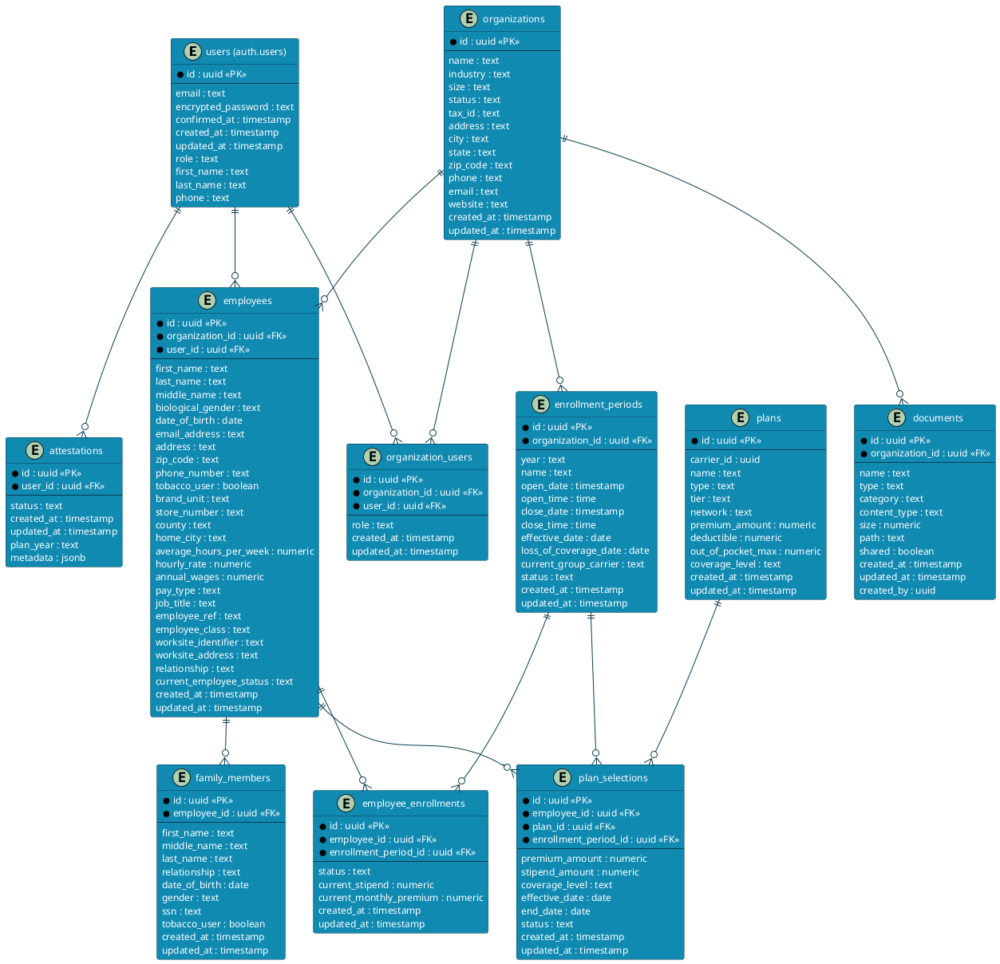

# Savii Benefits Portal - Entity Relationship Diagram

Below is a comprehensive Entity Relationship Diagram (ERD) for the Savii Benefits Portal application in PlantUML format. This can be visualized by copying the code into a PlantUML renderer.

## Entity Descriptions

### users
Central user table handled by Supabase Auth. Contains authentication information and basic user profile data for all system users.

### organizations
Represents employer organizations in the system. Contains organization details, contact information, and status.

### organization_users
Junction table connecting users to organizations with specific roles (admin, employee, etc.).

### employees
Detailed employee records with personal and employment information. Connected to both organizations and users.

### enrollment_periods
Defines enrollment windows for organizations, including open/close dates and status.

### employee_enrollments
Tracks each employee's enrollment status and financial details for specific enrollment periods.

### attestations
Records employee opt-in/opt-out decisions for ICHRA benefits. Contains a status field and metadata for additional information.

### plans
Available insurance plans with details about coverage, costs, and classifications.

### plan_selections
Records which plans employees have selected during specific enrollment periods.

### family_members
Stores information about employees' dependents and spouses who may be covered under their plans.

### documents
Stores metadata about documents in the system, with references to organizations for access control.

## Key Relationships

1. **Organizations to Employees**: One-to-many (an organization has many employees)
2. **Users to Employees**: One-to-one (each employee record is linked to a user account)
3. **Organizations to Enrollment Periods**: One-to-many (an organization can have multiple enrollment periods)
4. **Employees to Family Members**: One-to-many (an employee can have multiple family members)
5. **Employees to Plan Selections**: One-to-many (an employee can have multiple plan selections over time)
6. **Enrollment Periods to Plan Selections**: One-to-many (many plan selections can be made during an enrollment period)
7. **Plans to Plan Selections**: One-to-many (a plan can be selected by multiple employees)